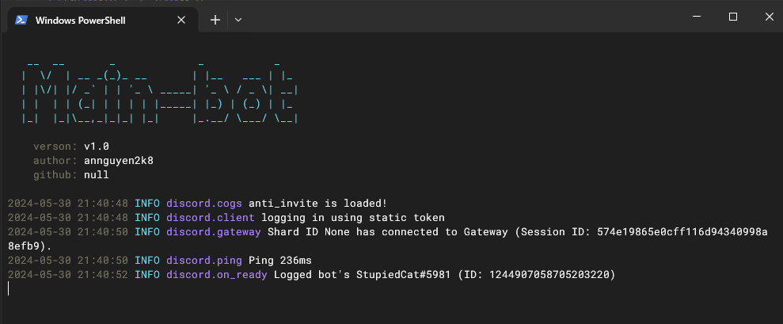

Example:

1. Open cmd and type `git clone https://github.com/annguyen2k8/Main-bot-py`

2. type `cd Main-bot-py`.

3. In `config.py` you can edit line 4 `TOKEN = os.environ.get("token_main_bot")` to `TOKEN = "YOUR TOKEN"` or use environment variable like me to protect your token.

4. And run with command `python main.py` to start bot.

5. I will code many feature cogs and you can download, add it in folder `cogs`.

**NOTE**: I have code a anti send invite link in discord in folder `cogs/anti_invite`, you can use `/anti_invite <enable|disable>` to toggle anti invite.
